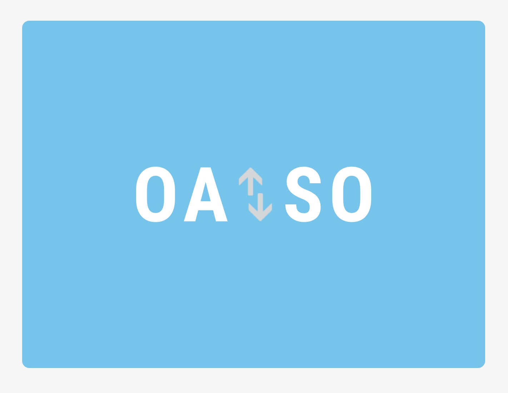

# イザカヤ x Tech「OAISO」

**居酒屋での注文から決済を一気通貫に管理するWeb伝票サービス**

[**Youtubeへのリンク**](https://youtu.be/jpBS05EFd7Y)

## 製品概要

### 背景

私達が想定するユーザーは居酒屋のオーナーと来店客である。
居酒屋における注文や決済の手順には次の課題がある。

1. 注文に時間がかかりすぎる
    - 飲食店にとっては人件費の問題
    - 来店客にとってはサービス体験の問題
2. 専用端末は導入コストが高すぎる (店舗オーナーの観点)
    - 小中規模の居酒屋で30万円から50万円ほど
3. 来店客は注文のためだけの専用アプリを入れたくない

また、**近年の日本限定**で次のような問題もある。

4. 様々な決済サービスが乱立しているため飲食店側の対応コストが高い
    - Apple Pay, Google Pay, LINE Pay, Origami Pay, 楽天Payなど
    - クレジットカードやIC決済への対応が望まれる場合も多い

### 製品説明

OAISOではテーブルごとに貼られたQRコードを読み取って、メニューを閲覧・注文できる。
また、食後はWebページだけで決済を行うことができる。
こうすることで、飲食店はホールスタッフの人件費を著しく削減でき、来店客もスタッフの不足による不便を感じなくなる。

### 特長

#### 1. 注文にホールスタッフを必要としない

  

テーブルごとにQRコードが発行されて、それを読み取ることでそのお店のメニューから注文をすることができる。

スタッフに注文したいときうまくオーダーできなかった経験は誰でもあるが、
注文はリアルタイムに可視化されるため、オーダーの不通はなくなる。
また、店舗スタッフは客をどのくらい待たせているのかがわかる。

#### 2. 導入コストが低い

導入ハードルが低く、客と店の双方にメリットのある決済

  

  
簡単に注文、決済をすることができるUI

サービスへの導入のハードルが非常に低い。

注文用の専用端末が1店舗あたり30万円から50万円の導入費用が必要な一方で、
OAISOはQRコードをテーブルや伝票に貼り付けるだけで良いので非常に導入コストが低い。

飲食店の利用客にとってはアプリのインストールが必要なく、Webで決済を行うこともできるのでストレスがない。
特にApple PayなどはWeb上で生体認証を利用でき、シームレスな注文・決済を行える。

つまり、**「システム運用のコストを大幅に抑えながら注文から決済までの滑らかでストレスのないユーザー体験の提供する」** ことができる。

#### 3. 様々な決済サービスに対応

クレジットカードやApple Pay・LINE Payなど多くの決済サービスに対応している。
売上はOAISOを介して飲食店に振り込まれるため、飲食店側は様々なサービスにノーコストで対応できる。

電子決済が普及している中国ではWeChat Payというサービスが普及しているという事情があるが、
日本ではまだそれに相当するような普及したサービスはない。
そのため、飲食店のオーナーがある1つの決済方法に対応したところで、カバーできる顧客層は厚くない。
よって、日本では様々な決済サービスと店舗オーナーを結びつける中間サービスが必要になると私達は考えている。

#### 4. ホールの状況や注文を来店客と紐づけて可視化できる

  

  
リアルタイムに座席表が空席(緑）から席が埋まっている状況(赤）に変わる様子

簡単に操作ができるUIで、図面をアップロードし席をドラッグで配置すればホールの状況を可視化することができる。

一つの円がテーブルに対応し、店舗レイアウトがどのようなものであってもオーダー状況をリアルタイムに可視化することができる。

また、それぞれのユーザーに対して注文をストリームのように可視化することができて、「来店客をどれだけ待たせているか」、「どのテーブルに運ぶべきか」を分かりやすく可視化できる。

  

  
来店客のメタデータも取得することができる

### 解決出来ること

1. 決済に関わる客と店舗の双方の手間や金銭的コスト
2. 注文から決済までの来店客の体験の向上
3. 空席確認などを来店前に参照できるので、客の来店体験を損なわないようにできる
    - 飲食店の客は空席をあらかじめ知ることができない
        - 実際には席は空いているが行くのをを控える
        - せっかく来店したのに満席で客の印象が悪くなる
    - 店舗の公式LINEボットに「いま空いてる？」という質問をできるようになる
4. 注文管理
    - どの注文がどの客なのかを管理するのは難しい
    - 間違えると大きく客の体験を損なってしまう

### 今後の展望

- 飲食店だけでなく、いろんな業務体系(カラオケ、カフェなど）に対応
- 飲食店と来店客の間のインタラクション機能
    - 料理をおすすめしたり、注文が遅れていることを通知したりできる
- 料理の遅れをアラートする機能
- どれくらいの時間で料理がくるかを飲食店から来店客へ情報提供する機能
- 注文のデータから売り上げの時間帯や客の年齢層などのデータ分析と可視化
- 様々な決済方法への対応
    - 現状、日本における電子決済サービスは群雄割拠の状況であり、メジャーな決済サービスは存在しないので、それらにノーコストで対応できる

## 開発内容・開発技術

### 活用した技術

#### フレームワーク・ライブラリ・モジュール

本プロダクトはGoogle Cloud PlatformのGoogle Kubernetis Engine上で可動するマイクロサービスとして開発した。
リポジトリ内のディレクトリ階層がそのままそれぞれのサービスに該当する。
以下でサービスごとの利用技術を説明する。

* frontend - 来店客向けWeb伝票サービス
    * Node.js
    * React
    * Firebase (Firestore, Storage, Authentication)
* floormap - 飲食店向け注文管理Webサービス
    * Node.js
    * Leaflet
    * RxJS
* payment - 決済用サービス
    * Golang
    * Iris
    * Stripe SDK
    * LINE Pay SDK
* store - 店舗情報管理サービス
    * Golang
    * Iris
* apib - APIドキュメントサービス
    * API BluePrint

### 独自開発技術

#### 2日間に開発した独自の機能・技術

2日間で特に力をいれた機能は次の4点である。

- フロントエンドのデザイン
- 注文共有のリアルタイム性
- 注文送信のリアルタイム性
- 注文状況の可視化

特に座席表をリアルタイムに作成することはインフラ的にも、フロントエンド的にも要求されるレベルが高い。
しかし、それこそが店舗の知りたい情報なので、リアルタイムでの可視化に努めた。

## こだわり

### 1. DevOps

Githubの`master`ブランチが更新されるたびにマイクロサービスで構築されたインフラ環境にサービスが即座にデプロイされる。
最新のバージョンを即座にデプロイすることで、ハッカソンにありがちな異様なまでの同時平行複数人開発を円滑に行えた。

### 2. フロントエンドでの通信の高速化

飲食店での注文を行うことのできる既存のサービスは、ほぼすべてモバイルアプリケーションとして提供されている。
これには「決済システムの充実」、「通信の節約」、「Push通知」などの利点がある。
しかしながら、メジャーなサービスがない状況では、ほとんどのユーザーは店頭でアプリケーションをダウンロードする必要があり、ユーザー体験の低下を招いていた。

実のところ、近年ではスマートフォンのブラウザが仕様的な面で著しい進化を遂げており、
以上で上げたアプリケーションの利点はWebサイトでも享受することができる。

**OAISOはこういった状況を踏まえた、「Webサービスのモバイルアプリケーションへの挑戦」であった。**

本サービスではServiceWorkerを用いて徹底的な通信の節約を行った。
具体的には画像データのprefetchとcacheである。
ユーザーがWebサイトを訪れるやいなや、その時点では表示されていない画像を取得するということをしている。

また、ルーティングにはReact Routerを用いているので、ユーザーはページ遷移を行ったつもりでも実は通信は発生していないという工夫も行っている。

こういった施策を行った理由は **「通信環境の悪い立地の多い居酒屋では通信を節約しなければユーザー体験を向上できない」** からである。

### 3. 様々な決済サービスへの対応

現在の日本には数多くの電子決済サービスが台頭しているが、それぞれの普及状況を見るとそれほど高いわけではない。
このような状況では、店舗は顧客のニーズに答えるためにすべての決済サービスを導入しなければならず導入コストが高い。
私達は、これを解決するために決済サービスと飲食店の摩擦を埋められるようなサービスを開発したかった。

私達が行ったように、注文から決済の流れを店舗が管理しなくても良いようにすれば店舗側の導入コストも減り、
日本における電子決済サービスの普及率は上昇すると思われる。

私達個人は徹底したキャッスレス派であり、現金での決済しか受け付けていない飲食店が非常に多い現状をなんとしても解決したかった。
そのため、このようなプロダクトを開発した。
